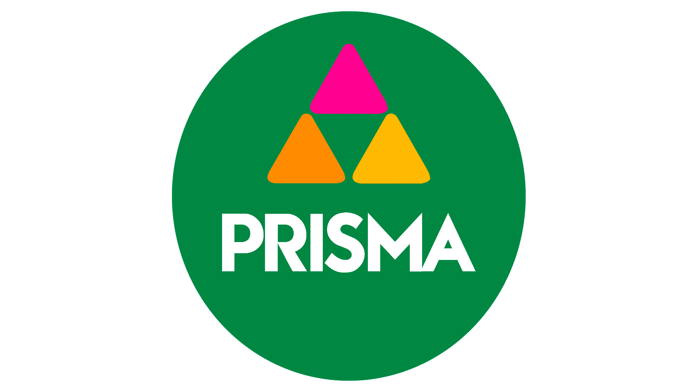
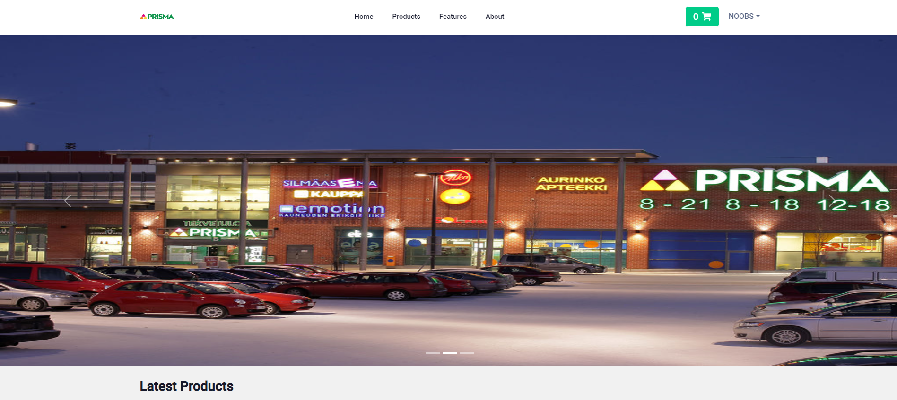
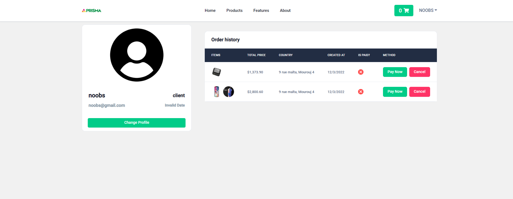
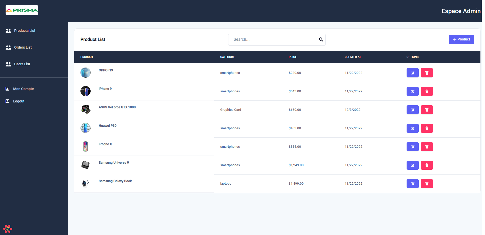

<div align="center">

  
  <h1>Prisma Shop </h1>
  
  <p>
    Online Store with react typescript express-ts Prisma
  </p>
  
  
<h4>
    <a href="https://type-shop.vercel.app/">View Demo</a>
  <span> · </span>
    <a href="https://github.com/hicmtrex/Cooper-Shop">Documentation</a>
  <span> · </span>
    <a href="https://github.com/hicmtrex/TypeShop-Frontend/issues/">Report Bug</a>
    <a href="https://github.com/hicmtrex/TypeShop-Frontend/issues/">Frontend</a>
  <span> · </span>
    <a href="https://github.com/hicmtrex/TypeShop-Backend">Backend</a>
  </h4>
</div>

<br />

<!-- About the Project -->

## :star2: About the Project

<!-- Screenshots -->

### :camera: Screenshots

<div align="center"> 
  
</div>

<div align="center"> 
  
</div>

<div align="center"> 
  
</div>
<!-- TechStack -->

### :space_invader: Tech Stack

<details>
  <summary>Backend</summary>
  <ul>
    <li><a href="https://www.typescriptlang.org/">Typescript</a></li>
    <li><a href="https://nodejs.org/en/">Node js</a></li>
    <li><a href="https://expressjs.com/">Express</a></li>
    <li><a href="https://www.prisma.io/">Prisma</a></li>
    <li><a href="https://www.mysql.com/">MySQL</a></li>
  </ul>
</details>

<details>
  <summary>👉 Frontend Repo</summary>
     <ul>
  <a href="https://github.com/hicmtrex/Prisma-Shop-Front">prismashop-backend</a>
     </ul>
  
</details>

<!-- Features -->

### :dart: Features

- Stripe payment
- Authentication
- Admin Content management system

### :key: Environment Variables

To run this project, you will need to add the following environment variables to your .env file

`PORT`
`NODE_ENV`
`ACCESS_TOKEN_SECRET`
`REFRESH_TOKEN_SECRET`
`STRIPE_SECRET_KEY`
`DATABASE_URL`

## :toolbox: Getting Started

<!-- Prerequisites -->

### :bangbang: Prerequisites

This project uses Yarn as package manager

```bash
 npm install --global yarn
```

<!-- Installation -->

### :gear: Installation

Install my-project with npm

```bash
  yarn install my-project
  cd my-project
```

<!-- Running Tests -->

### :test_tube: Running Tests

To run tests, run the following command

```bash
  yarn test test
```

<!-- Run Locally -->

### :running: Run Locally

Clone the project

```bash
  git clone https://github.com/hicmtrex/Prisma-Shop-Server
```

Go to the project directory

```bash
  cd my-project
```

Install dependencies

```bash
  npm install
```

Start the server

```bash
  npm start
```

<!-- License -->

## :warning: License

Distributed under the License. See LICENSE.txt for more information.

<!-- Contact -->

## :handshake: Contact

Hicm- [@twitter](https://twitter.com/hicmtrex) - hichembouallegue@gmail.com

## Support

<a href="https://www.buymeacoffee.com/hicmtrex" target="_blank" style="display: inline-block !important;"></a>

Be careful and donate just if it is within your possibilities, because there is no refund system. And remember that you don't need to donate, it is just a free choice for you. Thank you!
